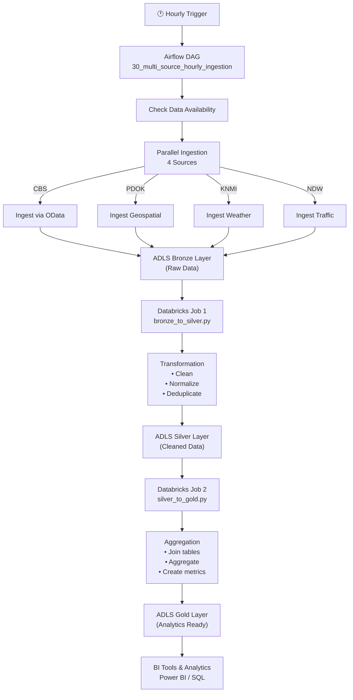

# Grontia - Complete Data Pipeline: Airflow → ADLS → Databricks

## Architecture Overview

```
┌──────────────────────────────────────────────────────────────────────────┐
│                          HOURLY DATA PIPELINE                            │
└──────────────────────────────────────────────────────────────────────────┘

DATA INGESTION (Airflow)
├── Check data availability (per source)
├── Ingest raw data from:
│   ├── CBS (Statistics Netherlands)
│   ├── PDOK (Geospatial)
│   ├── KNMI (Weather)
│   └── NDW (Traffic)
└── Write to ADLS Bronze Layer

                              ↓

ADLS LAYER 1: BRONZE (Raw Data)
├── cbs/cbs_bronze/{dataset}/ingestion_date={date}/
├── pdok/pdok_bronze/{dataset}/ingestion_date={date}/
├── knmi/knmi_bronze/{dataset}/ingestion_date={date}/
└── ndw/ndw_bronze/{dataset}/ingestion_date={date}/

                              ↓

DATA TRANSFORMATION (Databricks Job 1)
├── Read bronze layer (raw JSON, CSV, etc.)
├── Clean & normalize data
├── Deduplicate records
├── Add metadata (ingestion_date, source, etc.)
└── Write to ADLS Silver Layer

                              ↓

ADLS LAYER 2: SILVER (Cleaned Data)
├── cbs/silver_cbs_neighbourhood_key_figures/
├── cbs/silver_cbs_average_woz_value/
├── cbs/silver_cbs_housing_stock/
├── cbs/silver_cbs_household_income/
├── pdok/silver_pdok_*
├── knmi/silver_knmi_*
└── ndw/silver_ndw_*

                              ↓

DATA AGGREGATION (Databricks Job 2)
├── Join silver tables
├── Create analytical aggregations
├── Build business metrics
├── Aggregate by region, time, etc.
└── Write to ADLS Gold Layer

                              ↓

ADLS LAYER 3: GOLD (Analytics Ready)
├── cbs/gold_cbs_neighbourhood_analysis/
├── cbs/gold_cbs_property_value_trends/
├── cbs/gold_cbs_housing_market_analysis/
├── cbs/gold_cbs_socioeconomic_indicators/
└── consolidated/gold_regional_dashboard/

                              ↓

BI & ANALYTICS
├── Power BI / Tableau
├── Databricks SQL
└── API / Reports
```

## Flow Diagram



## Data Flow Steps

### Step 1: Airflow - Data Ingestion (Every Hour)
```bash
Airflow DAG: 30_multi_source_hourly_ingestion_adls.py
├── Start: 00:00, 01:00, 02:00, ... 23:00
├── Run time: ~5-15 minutes
└── Output: Raw data in ADLS bronze layer
```

**What Airflow Does:**
1. Verifies data is available from each source
2. Calls source APIs (CBS OData, PDOK WFS, KNMI API, NDW API)
3. Downloads raw data (JSON, CSV, XML, GeoJSON)
4. Writes to ADLS bronze layer with date partitioning
5. Records metadata (_summary.json)
6. Triggers Databricks bronze-to-silver job

### Step 2: Databricks - Bronze to Silver Transformation
```bash
Databricks Job: bronze_to_silver.py
├── Triggered by: Airflow (after ingestion completes)
├── Run time: ~5-10 minutes
└── Output: Cleaned data in ADLS silver layer
```

**What Databricks Does:**
```python
# Read from bronze (raw data)
df = spark.read.json("bronze/cbs/cbs_bronze/neighbourhood_key_figures/.../typeddataset.json")

# Transform
df = df.explode("value")  # Flatten nested JSON
df = df.drop_duplicates()  # Remove duplicates
df = df.withColumn("source", F.lit("cbs"))  # Add metadata

# Write to silver (cleaned, normalized)
df.write.parquet("silver/cbs/silver_cbs_neighbourhood_key_figures/")
```

**Transformations Applied:**
- Flatten nested JSON structures
- Normalize column names and data types
- Remove null/invalid records
- Deduplicate records
- Add source and ingestion metadata
- Convert to Parquet (optimized columnar format)

### Step 3: Databricks - Silver to Gold Aggregation
```bash
Databricks Job: silver_to_gold.py
├── Triggered by: Airflow (after bronze-to-silver completes)
├── Run time: ~5-10 minutes
└── Output: Analytics tables in ADLS gold layer
```

**What Databricks Does:**
```python
# Read from silver (cleaned data)
neighbourhood_df = spark.read.parquet("silver/cbs/silver_cbs_neighbourhood_key_figures/")
income_df = spark.read.parquet("silver/cbs/silver_cbs_household_income/")

# Join and aggregate
gold_df = neighbourhood_df.join(income_df, on=["RegioS", "Perioden"], how="left")
gold_df = gold_df.groupBy("RegioS", "Perioden").agg(
    F.avg("population").alias("avg_population"),
    F.avg("household_income").alias("avg_income"),
    ...
)

# Write to gold (analytics ready)
gold_df.write.parquet("gold/cbs/gold_cbs_socioeconomic_indicators/")
```

**Aggregations Created:**
- `gold_cbs_neighbourhood_analysis` - Population, households, income
- `gold_cbs_property_value_trends` - WOZ property values by region
- `gold_cbs_housing_market_analysis` - Housing stock with values
- `gold_cbs_socioeconomic_indicators` - Income indicators
- `gold_regional_dashboard` - Multi-source consolidated view

## File Locations

### ADLS Bronze Layer
```
bronze/
├── cbs/cbs_bronze/
│   ├── neighbourhood_key_figures/ingestion_date=2026-03-27/
│   │   ├── tableinfos.json
│   │   ├── dataproperties.json
│   │   ├── typeddataset.json
│   │   └── _summary.json
│   └── ... (other CBS datasets)
├── pdok/pdok_bronze/ → ...
├── knmi/knmi_bronze/ → ...
└── ndw/ndw_bronze/ → ...
```

### ADLS Silver Layer
```
silver/
├── cbs/
│   ├── silver_cbs_neighbourhood_key_figures/ (Parquet)
│   ├── silver_cbs_average_woz_value/ (Parquet)
│   ├── silver_cbs_housing_stock/ (Parquet)
│   └── silver_cbs_household_income/ (Parquet)
├── pdok/
│   ├── silver_pdok_addresses/ (Parquet)
│   └── ...
└── ... (KNMI, NDW)
```

### ADLS Gold Layer
```
gold/
├── cbs/
│   ├── gold_cbs_neighbourhood_analysis/ (Parquet)
│   ├── gold_cbs_property_value_trends/ (Parquet)
│   ├── gold_cbs_housing_market_analysis/ (Parquet)
│   └── gold_cbs_socioeconomic_indicators/ (Parquet)
└── consolidated/
    └── gold_regional_dashboard/ (Parquet)
```

## Setup Instructions

### 1. Configure Databricks Workspace

```bash
# Install required libraries
pip install pyspark databricks-sql-connector azure-storage-file-datalake

# Configure ADLS access in Databricks
# Set in cluster init script or notebook:
spark.conf.set("fs.azure.account.key.{storage_account}.dfs.core.windows.net", 
               "{storage_account_key}")
```

### 2. Create Databricks Jobs

**Job 1: Bronze to Silver**
```
Name: bronze-to-silver-transformation
Notebook: /Workspace/Repos/grontia/processing/databricks/bronze_to_silver.py
Cluster: Standard 4-16 workers
Schedule: Hourly (triggered by Airflow)
Timeout: 15 minutes
```

**Job 2: Silver to Gold**
```
Name: silver-to-gold-aggregation
Notebook: /Workspace/Repos/grontia/processing/databricks/silver_to_gold.py
Cluster: Standard 4-16 workers
Schedule: Hourly (triggered by Airflow)
Timeout: 15 minutes
```

### 3. Update Airflow Configuration

```yaml
# airflow_settings.yaml
connections:
  - conn_id: databricks_default
    conn_type: databricks
    host: "https://your-databricks-workspace.cloud.databricks.com"
    login: "your-username"
    password: "your-token"
```

### 4. Deploy

```bash
# Push code to git
git add .
git commit -m "feat: Add databricks transformation pipeline"
git push origin main

# GitHub Actions will:
# 1. Build Docker image
# 2. Push to ACR
# 3. Deploy DAGs to Astronomer
# 4. Deploy Databricks notebooks
```

## Monitoring

### Airflow Logs
```
DAG: 30_multi_source_hourly_ingestion_adls
├── Task: start
├── Task: cbs_dataset_*
├── Task: pdok_dataset_*
├── Task: knmi_dataset_*
├── Task: ndw_dataset_*
├── Task: trigger_bronze_to_silver_transformation
├── Task: trigger_silver_to_gold_transformation
└── Task: end
```

### Databricks Job Runs
```
Job: bronze-to-silver-transformation
├── Input: ADLS bronze layer
├── Processing time: ~5-10 minutes
├── Output: ADLS silver layer
└── Status: Success/Failed

Job: silver-to-gold-aggregation
├── Input: ADLS silver layer
├── Processing time: ~5-10 minutes
├── Output: ADLS gold layer
└── Status: Success/Failed
```

## Performance Expectations

| Stage | Input Size | Processing Time | Output Size |
|-------|-----------|-----------------|------------|
| Ingest (Airflow) | API endpoints | 5-15 min | 100MB-1GB |
| Bronze→Silver | Raw JSON/CSV | 5-10 min | 50-500MB |
| Silver→Gold | Cleaned data | 5-10 min | 10-100MB |
| **Total** | - | **15-35 min** | - |

## Troubleshooting

### Airflow Issues
- **DAG not found**: Check Airflow DAGs folder
- **Databricks connection failed**: Verify token and workspace URL
- **ADLS write failed**: Check storage account credentials

### Databricks Issues
- **File not found**: Verify ADLS paths and access
- **Out of memory**: Increase cluster size
- **Schema mismatch**: Check data types in transformations

## Next Steps

✅ **Completed:**
- Airflow ingestion from all sources
- ADLS bronze layer with partitioning
- Databricks bronze-to-silver transformation
- Databricks silver-to-gold aggregation

🚧 **TODO:**
- [ ] Implement PDOK data ingestion
- [ ] Implement KNMI data ingestion
- [ ] Implement NDW data ingestion
- [ ] Add data quality checks
- [ ] Create BI dashboards
- [ ] Add monitoring/alerting